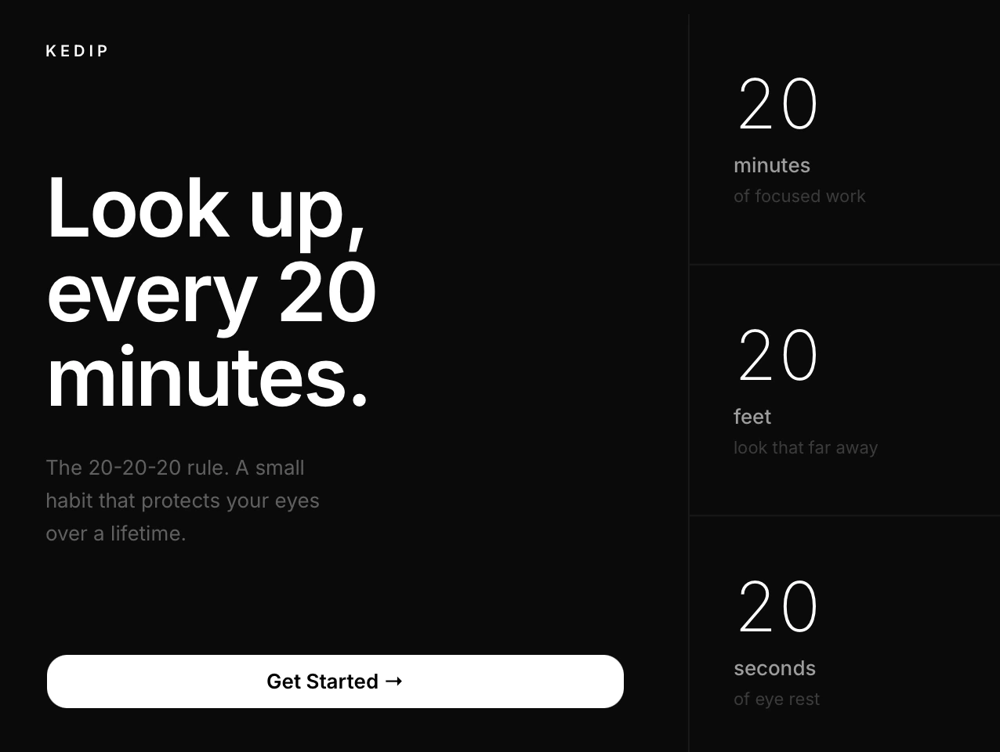
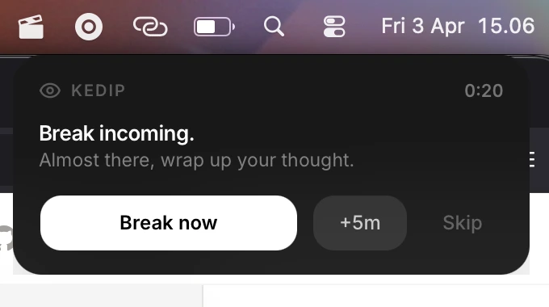
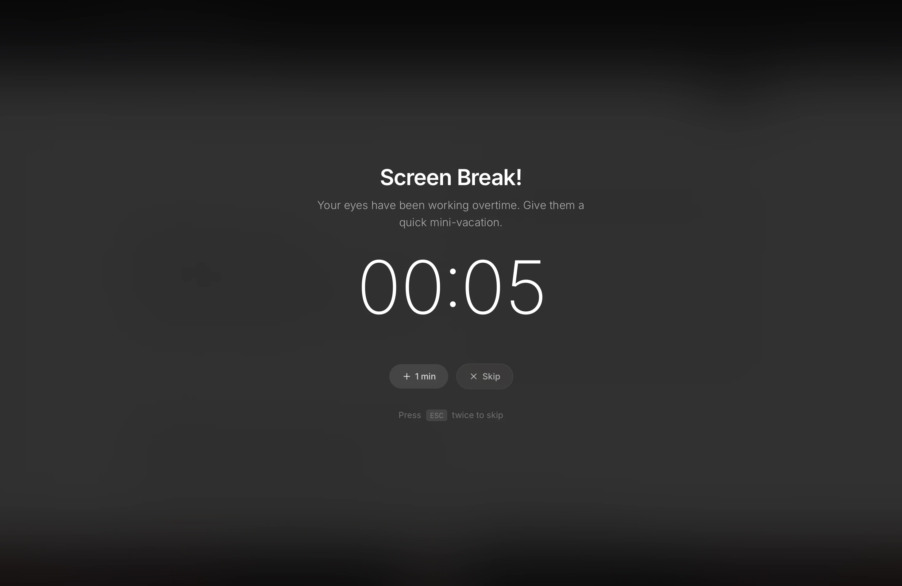
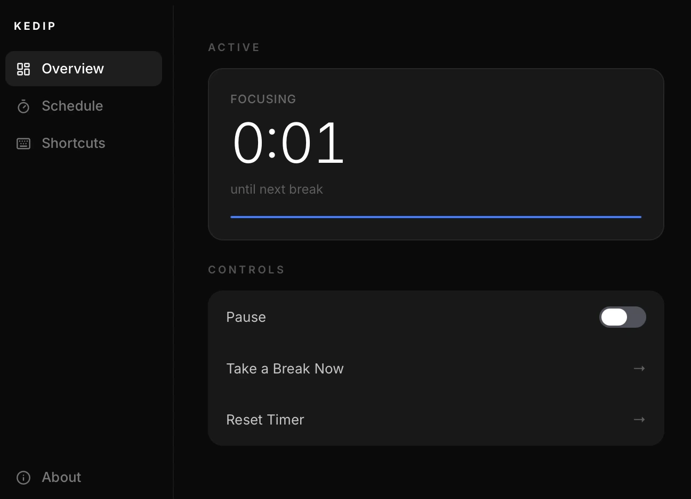

# Kedip

Every 20 minutes, look 20 feet away for 20 seconds. Kedip keeps track so you don't have to.

---

<table>
  <tr>
    <td></td>
    <td></td>
  </tr>
  <tr>
    <td></td>
    <td></td>
  </tr>
</table>

---

> **Early development notice** — Kedip is actively developed and tested on macOS. Windows and Linux builds are provided but may have rough edges or visual issues. If you run into problems, please [open an issue](https://github.com/dendianugerah/kedip/issues).

---

## Install

### Homebrew (macOS, recommended)

```bash
brew tap dendianugerah/tap
brew install --cask kedip
```

### Direct download

Grab the latest binary from the [**Releases**](https://github.com/dendianugerah/kedip/releases) page.

| Platform | File |
|----------|------|
| macOS | `.dmg` |
| Windows | `.msi` / `.exe` |
| Linux | `.AppImage` / `.deb` |

> **macOS (direct download):** The app is not notarized yet. If macOS says "damaged and can't be opened", run this in Terminal:
> ```
> xattr -cr /Applications/kedip.app
> ```
> Or right-click the app → Open → Open to bypass once.
>
> **Windows:** SmartScreen may warn you. Click **"More info" → "Run anyway"** — the app is open source and safe.

---

## Features

- Fullscreen break overlay with countdown
- Floating pill notification, snooze, skip, or break now
- Configurable work and break durations
- Runs in the menu bar, out of your way
- No account, no cloud, no telemetry. Fully offline.

---

## Development

**Prerequisites:** [Rust](https://rustup.rs) · [Bun](https://bun.sh)

```bash
git clone https://github.com/dendianugerah/kedip
cd kedip
bun install

bun run desktop:dev   # desktop app
bun run web:dev       # landing page
```

```bash
bun run desktop:build
# → apps/desktop/src-tauri/target/release/bundle/
```

---

## Contributing

PRs are welcome. Open an issue first for large changes.

## License

[MIT](./LICENSE)
